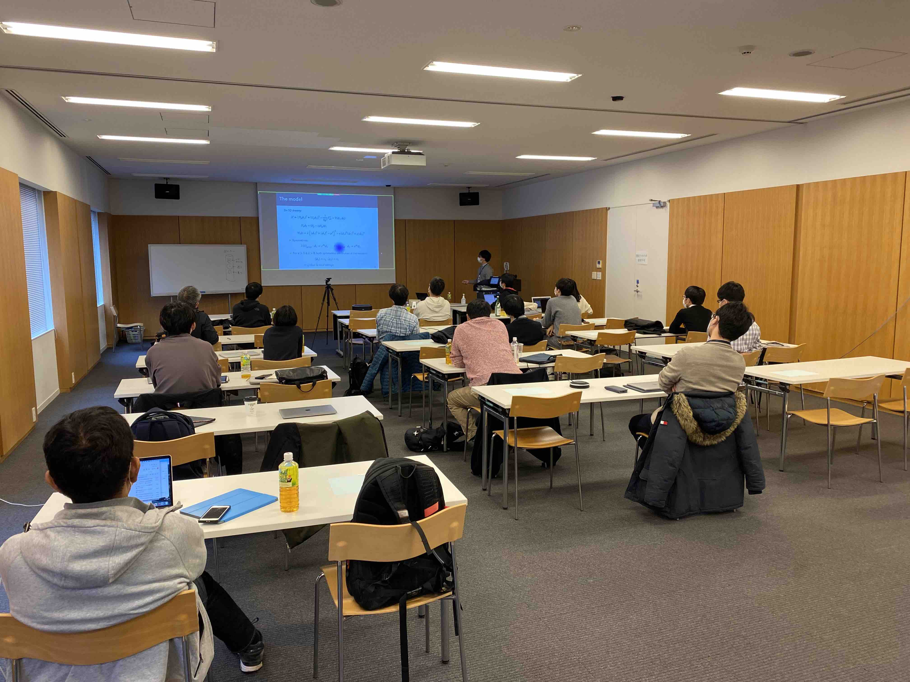
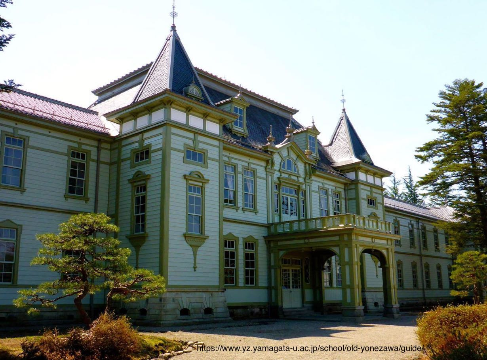
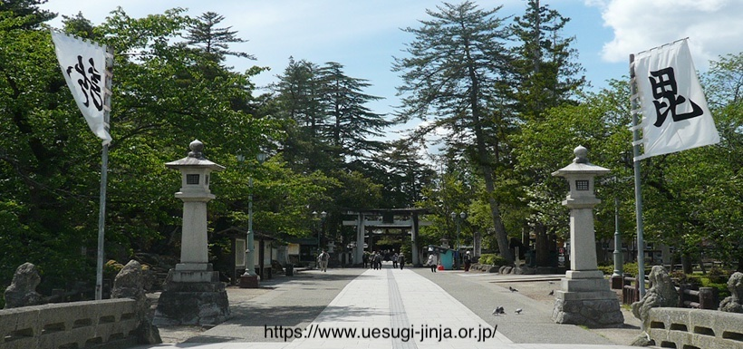
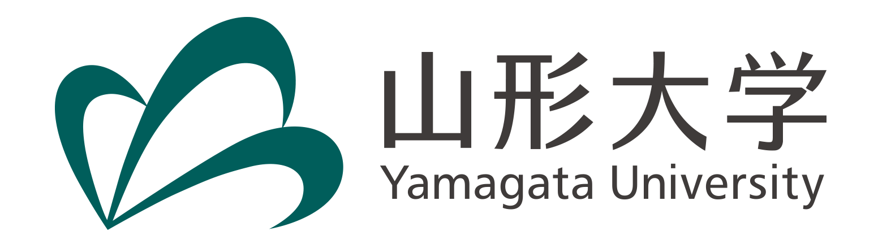
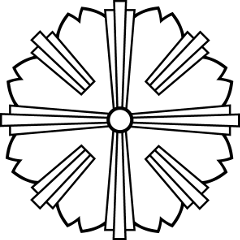

---
<!-- コメントアウトの方法はこれ　-->

## Purpose

In 2016, LIGO confirmed the existence of gravitational waves, and in 2023, a pulsar timing array, NANOGrav, reported a gravitational wave background signal. Gravitational waves are becoming a useful tool to explore the early universe and even fundamental physics. A variety of ways to detect gravitational waves are ongoing and proposed, covering a vast range of gravitational wave frequency bands.

One of the observable gravitational wave sources is a phase transition in the early universe, leading to bubbles and/or topological defects. Axion, one of the dark matter candidates, also predicts composite topological defects. Therefore, now will be a high time to understand the basic properties of topological solitons originating in fundamental physics. Topological solitons are also important in low-energy physics such as superconducters. 

Our purpose of this workshop is to share and discuss recent progress and new ideas on frontiers in gravity and fundamental physics and
to trigger the interplay between fundamental physicists and cosmologists.

***We welcome contributed talks, with a preference for on-site speakers.***  

This workshop is hybrid. We broadcast the workshop via Zoom to online participants.  
All the talks in this workshop are given in *English*.
The time zone is JST (UTC+9).

### Keywords

Keywords: 
- dark matter, 
- axions, 
- phase transitions,
- solitons, (including topological defects, Q-balls, oscillons,) 
- gravitational waves.

## Invited Speakers

- Junseok Lee (Tohoku University)

- Kaloian Lozanov (Kavli IPMU)

- Wakutaka Nakano (KEK)

- Nobuchika Okada (University of Alabama, Online)
  
- Takashi Toma (Kanazawa University)

- Graham White (University of Southampton, Online)

)

)

## Photo
<!--  -->

## [Registration](https://docs.google.com/forms/d/e/1FAIpQLScF8hF8p2rPiRJFfK1DiXLNzbmRk_zwmg6DocQqgY1qxQ03ng/viewform?usp=sf_link) 

<!--Both of the registrations for on-site participation and for online participation have been closed. -->

## Important Dates

Abstract Submission Deadline (for both on-site and online contributed talks): ***extended until the slots for contributed talks are filled (no later than 15th January, 2025)*** *~~15th December, 2024~~*

Registration deadline for on-site participants: ***15th January, 2025*** *~~15th December, 2024~~*

Registration deadline for online participants: 15th January, 2025

## Schedule

From 4th to 5th of March, 2025

We have 
- 6 invited talks (50min + 10min for each)
- contributed talks (expected to be 15min + 5min, but it may be changed depending on the number of speakers.)

## [Venue](https://maps.app.goo.gl/M32i6LRHfAydxfDZA)

Seminar Room 1 and 2, 4th building,
[Faculty of Engineering,
Yamagata University](https://www.yz.yamagata-u.ac.jp/en/), 
4-3-16, Jonan, Yonezawa, 992-8510, Yamagata

- 8min from Yonezawa Station by taxi
   - Yonezawa Station (130min from Tokyo Station, 70min from Sendai Station by Shinkansen)

- 10min from Minami-Yonezawa Station on foot
   - Minami-Yonezawa Station (6min from Yonezawa Station by Yonesaka line)

- 12min from Uesugi Jinja Mae Bus Stop on foot 
    - Uesugi Jinja Mae Bus Stop (2 hours from Sendai Station by highway bus)
 
## Introduction of Yonezawa

Yonezawa has a long history and is famous for being the land ruled by the Date and Uesugi families. Uesugi Shrine, Uesugi Clan Mausoleum, and Kasuga-san Rinsen-ji, the family temple of the Uesugi, are located here. [The main building of Yonezawa Higher Technical School](https://www.yz.yamagata-u.ac.jp/school/old-yonezawa/guide/), the predecessor of Yamagata University's Faculty of Engineering, still exists in Yamagata University. The Okitama (or some call "Oitama") region, centered on Yonezawa, has many hot springs, including Onogawa Onsen, Shirabu Onsen, and Akayu Onsen.

For more information on Yonezawa, please visit, e.g., [Travel Yonezawa](https://en.travelyonezawa.com/).

 

## Information

<!-- - Guest house in the campus: [Guest House YU (4MB pdf file)](guest_house_YU.pdf) (5min on foot from the venue) --> 

- Hotels:
   - [Den's Hotel Yonezawa](https://www.tokyuhotels.co.jp/yonezawa-e/index.html) (5min by taxi from the campus)
   - [Hotel Alpha-1 Yonezawa](https://www.alpha-1.co.jp/yonezawa/) (5min on foot from the Yonezawa station)
   - [Hotel Route Inn Yonezawa](https://www.route-inn.co.jp/hotel_list/yamagata/index_hotel_id_206/) (10min on foot from the Yonezawa station)

- Local Buses:
   -  [City circulation line (clockwise)](https://honyaku.j-server.com/LUCYNZWC/ns/tl.cgi/https://www.city.yonezawa.yamagata.jp/seikatsu_navi/bus/6937.html?SLANG=ja&TLANG=en&XMODE=0&XPARAM=number-search-input,sp-number-search-input,&XCHARSET=utf-8&XPORG=,,&XJSID=0) (Get off at Yamadai-Seimon, [Japanese version](https://www.city.yonezawa.yamagata.jp/material/files/group/8/junkan_right_.pdf))
   -  [Gakuen-Toshi Line](https://honyaku.j-server.com/LUCYNZWC/ns/tl.cgi/https://www.city.yonezawa.yamagata.jp/seikatsu_navi/bus/6939.html?SLANG=ja&TLANG=en&XMODE=0&XJSID=0) (Get off at Johnan-Nichome, [Japanese version](https://www.city.yonezawa.yamagata.jp/material/files/group/8/gakuenntoshizikoku.pdf) )

<!-- - Local Buses: [Yamako Bus](http://www.yamakobus.co.jp/rosenbus/jikoku/frame/shirabu.html) (Get off at Johnan-Nichome) -->

## Organizers

  
- Masato Arai (Yamagata University)

- Minoru Eto (Yamagata University)

- Asuka Ito (Kobe University)

- Ryusuke Jinno (Kobe University)
  
- Ippei Obata (Kavli IPMU)

- Yuki Sakakihara (Yamagata University, Chief organizer)

[Contact us](https://docs.google.com/forms/d/e/1FAIpQLSe1yUV56spXI7rPPEExUkI4PJ2Ucm2y_u3T3oRuPCq6f07zOw/viewform?usp=sf_link)

## Secretary

- Emiko Okatsu (Yamagata University)

## Sponsors

This workshop is supported by the following KAKENHI and Yamagata University.

- Grant-in-Aid for Scientific Research (C)
    - 24K07013 for Ryusuke Jinno (PI)

- Grant-in-Aid for Research Activity Start-up
    - 23K19048 for Ryusuke Jinno (PI)
    - 22K20365 for Yuki Sakakihara (PI)
 
- Grant-in-Aid for Early-Career Scientists
    - 22K14034 for Asuka Ito (PI)
    - 19K14702 for Ippei Obata (PI)
      
- Grant-in-Aid for Exploratory Research
    - 23K17687 for Ryusuke Jinno (co-PI)

- Grant-in-Aid for Scientific Research (B) 
    - 22H01221 for Minoru Eto (co-PI)

The venue and facilities are provided by Yamagata University.

 <!---->
<!-- -->

